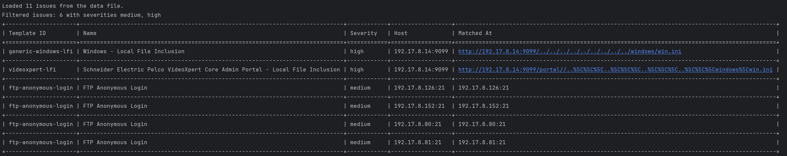

# Nuclei Parser on python

### Use python3 virtual environment

* Linux
```bash
python3 -m venv venv; source venv/bin/activate
```
* Windows
```powershell
python3 -m venv venv; .\.venv\Scripts\activate.ps1
```

### Usage

* Input data
```bash
python3 nuclei-parser.py -d nuclei.json
```
* Choose severity
```bash
python3 nuclei-parser.py -d nuclei.json -s high
```
```bash
python3 nuclei-parser.py -d nuclei.json -s medium,high,critical
```
* Render json to html
```bash
python3 nuclei-parser.py -d nuclei.json -s medium,high,critical --html
```

## Features
* Script autosort vulns by severity
* Group by name

## Output in terminal


## Output in html file
